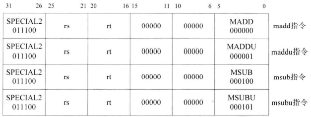

# 1
初步数据通路


最小SOPC结构


1 ori指令


解决RAW数据相关问题:
1. 将执行阶段的结果送入译码阶段(在id.v多加端口)
2. 将访存阶段的结果送入译码阶段(在id.v多加端口)
3. 在regfile读端口中判断当前读端口地址是否与写端口相同


ori rt,rs,immediate:  rt<- rs|immediate(无符号扩展至32bit)


and rd,rs,rt: rd<- rs & rt  
or rd,rs,rt: rd<- rs & rt  
xor rd,rs,rt: rd<- rs^rt(异或)  
nor rd,rs,rt:rd<-~(rs|rt)(同或)  


andi rt,rs,immediate:rt<-rs & immediate(无符号扩展至32bit)  
xori rt,rs,immediate:rt<-rs^immedaite(同上)


<!-- lui rt,immediate: reg[rt] = [imm][16b'0] -->


sll rd,rt,sa: rd<- rt<<sa(logic)  
srl rd,rt,sa: rd<- rt>>sa(logic)  
sra rd,rt,sa: rd<- rt>>sa(arithmetic)  
sllv rd,rt,rs: rd<-rt<<rs\[4:0](logic)  
srlv rd,rt,rs: rd<-rt>>rs\[4:0](logic)  
srav rd,rt,rs: rd<-rt>>rs\[4:0](arithmetic)


nop ssnop的效果相当于向0号寄存器写值，无论写多少都为0，不用特意实现，当作特殊sll即可。  


movn rd,rs,rt: if regs[rt]!=0 then rd<-rs   
movz rd,rs,rt: if resg[rt]==0 then rd<-rs  

(执行阶段获取hi、lo寄存器操作数)  
mfhi rd: rd<-hi  
mflo rd: rd<-lo  

mthi rs: hi<-rs  
mtlo rs: lo<-rs  


add rd,rs,rt:rd<-rs+rt 有溢出检查  
addu rd,rs,rt:rd<-rs+rt 无溢出检查   
sub rd,rs,rt:rd<-rs-rt 有溢出检查  
subu rd,rs,rt:rd<-rs-rt 无溢出检查  
slt rd<-(rs< rt):有符号比较运算 真值有1和0  
sltu rd,rs,rt:无符号比较运算  


addi rt,rs,immediate:rt<-rs+imm imm符号扩展 溢出检查  
addiu rt,rs,imm:rt<-rs+imm imm符号扩展 无溢出检查   
slti rt,rs,imm:rt<-(rs< imm) imm符号扩展 有符号数比较  
sltiu rt,rs,imm:rt<-(rs< imm) imm符号扩展 无符号比较  


<!-- clz rd,rs:rd<-count_leading_zero rs 对地址为rs的通用寄存器的值从其最高位开始向最低位检查，直到遇到值为'1'的位，将该位之前'0'的个数保存到地址为rd的通用寄存器的中。如果rs中为全0，则将32保存到rd中。  

clo rd,rs:rd<-count_leading_ones rs 对地址为rs的通用寄存器的值，从其最高位开始向最低位方向检查，直至遇到值为'0'的位，将该位之前'1'的个数保存到地址为rd的通用寄存器中。如果rs为全1，那么将32保存到rd中。   -->


<!-- mul,rd,rs,rt:rd<-rs *rt 有符号乘 低32bit保存到rd中   -->
mult rs,rt:{hi,lo}<-rs *rt  有符号乘  
multu rs,rt:{hi,lo}<-rs *rt 无符号乘  




madd rs,rt:{hi,lo}<-{hi,lo}+rs*rt 有符号乘累加   
maddu rs,rt:{hi,lo}<-{hi,lo}+rs*rt 无符号乘累加  
msub rs,rt:{hi,lo}<-{hi,lo}-rs*rt 有符号乘累减   
msubu rs,rt:{hi,lo}<-{hi,lo}-rs*rt 无符号乘累减  


div rs,rt:{HI,LO}<-rs/rt 有符号整除  
divu rs,rt:{HI,LO}<-rs/rt 无符号整除  


jr rs: pc<-rs  
<!-- jalr rs or jalr rd,rs: rd<-return_address pc<-rs  rs寄存器中的值作为pc的下一条指令的地址，同时将跳转指令的下一条指令地址作为返回地址保存在rd寄存器中，没有指明rd则默认为$31   -->
j target: pc<-{(pc+4)[31:28],target[25:0],2'b00} 转移到新的指令地址，新指令地址的低28位是target值左移2位的值，高4位是跳转指令后面延迟槽指令的地址高4位。  
<!-- jal target: 转移的值与j相同，不同的是，此条指令还要将转移指令的下一条指令位置保存在寄存器$31中   -->


所有分支指令的0~15bit都是offset，如果发生转移，则将offset左移两位并符号扩展至32bit，然后与延迟槽指令地址相加，结果就是转移的目的地址，从该地址取指令。

beq rs,rt,offset: if rs==rt then branch  
b offset: 无条件转移 不必特意实现 当beq的rs和rt都为0时就是  
bgtz rs,offset: if rs>0 then branch  
blez rs,offset: if rs<=0 then branch  
bne rs,rt,offset: if rs!=rt then branch  
bltz rs,offset: if rs<0 then branch  
<!-- bltzal rs,offset: if rs<0 then branch 并且将转移指令的下一条指令作为返回位置保存在寄存器$31   -->
bgez rs,offset: if rs>=0 then branch  
<!-- bgezal rs,offset: if rs>=0 then branch 并且将转移指令的下一条指令作为返回位置保存在寄存器$31    -->
bal offset: 无条件转移 并且将转移指令的下一条指令作为返回位置保存在寄存器$31 bal是bgezal的特殊情况，当bgezal的rs为0时就是bal，不需要额外实现  


## 加载存储指令


先将16bit的offset符号扩展至32bit 然后与base指示的寄存器值相加得到内存地址:  
加载地址=signed_extend(offset)+reg[base]

lb rt,offset(base): 读取一个字节符号扩展至32bit 保存到rt  
lbu rt,offset(base): 读取一个字节无符号扩展至32bit 保存到rt  
<!-- lh rt,offset(base): 读取一个半字符号扩展至32bit 保存到rt 地址有字节对齐要求 最低位必须是0  
lhu rt,offset(base): 读取一个半字无符号扩展至32bit 保存到rt 地址有字节对齐要求 最低位必须是0   -->
lw rt,offset(base): 读取一个字保存到rt 地址有字对齐要求 最低两位必须是0


sb rt,offset(base): rt寄存器的最低8bit保存到指定地址  
<!-- sh rt,offset(base): rt寄存器的最低16bit保存到指定地址 地址有字节对齐要求 最低位必须是0   -->
sw rt,offset(base): rt寄存器的值保存到指定地址 地址有字节对齐要求 最低2位必须是0  

### 格式要求
大端模式 高位保存在低地址


<!-- lwl rt,offset(base): 从内存中指定的加载地址处 加载一个字的最高有效部分 对加载地址没有要求 从而允许地址非对齐  效果为:   
加载地址load_addr=signed_extended(offset)+reg[base]   
n=load_addr[1:0]   
load_addr_align=load_addr-n   
lwl将从地址load_addr_align处加载一个字也就是4个字节，然后把这个字的最低4-n个字节加载到rt寄存器的高位，剩余位置不变   

lwr rt,offset(base): 从内存中指定的加载地址处 加载一个字的最低有效部分 对加载地址没有要求 从而允许地址非对齐  效果为:   
加载地址load_addr=signed_extended(offset)+reg[base]    
n=load_addr[1:0]   
load_addr_align=load_addr-n
lwr将从地址load_addr_align处加载一个字也就是4个字节，然后把这个字的最高n+1个字节保存到rt寄存器的低位，剩余位置不变


注意此处的最低4-n个字节和最高n+1个字节是相对于该字而言而不是相对于内存地址而言 -->


<!-- swl rt,offset(base): 将地址为rt寄存器的高位部分存储到内存中的指定地址处 对存储地址没有对齐要求 效果如下:    
存储地址store_addr=signed_extended(offset)+reg[base]   
n=store_addr[1:0]   
store_addr_align=store_addr-n   
swl指令的作用是将地址为rt的通用寄存器的最高4-n个字节存储到store_addr处 也就是把最高4-n个字节存储到store_addr_align的低位 高位不变    

swr rt,offset(base): 将地址为rt寄存器的低位部分存储到内存中的指定地址处 对存储地址没有对齐要求 效果如下:    
存储地址store_addr=signed_extended(offset)+reg[base]   
n=store_addr[1:0]   
store_addr_align=store_addr-n   
swr指令的作用是将地址为rt的寄存器的最低n+1个字节存储到store_addr_align也就是高位 低位不变    -->


</br>  
</br>


## 原子操作指令


这两条指令与原子操作有关，我们知道在操作系统多任务执行的环境下。
```c
wait(semaphore);
    atomic operation
signal(semaphore)
```

其中wait函数的执行是一个原子操作。  
在mips32的架构中，并不保证信号量进制一定是原子性的，允许检测和设置在没有原子性的保证下进行，但只在它确实是原子的运行情况下才会让设置生效。  

ll从内存中加载一个字，还会将处理器内部的一个链接状态位LLbit置为1，表明发生一个链接加载操作，并将链接加载的地址保存到特殊寄存器LLAddr之中(在多处理器之中有用)。  
ll指令执行完毕后，进行一定的操作比如修改加载的数据，然后执行rc指令，如果有以下两种情况干扰，受到干扰后，处理器会将链接状态位LLbit置为0。

1. ll、sc指令之间产生异常，从而进入异常处理过程或者发生线程切换。
2. 多处理器系统中，另一个CPU改写了RMW序列要操作的内存空间。

对于openmips而言只有第一种情况。sc指令会从ll指令开始的序列进行检查判断LLbit是否为1，如果始终是1那么操作就是原子的，sc会对ll加载数据的地址进行写回操作，并设置一个通用寄存器的值为1标识成功。反之不进行写回操作，并设置一个通用寄存器的值为0标识失败。  

ll rt,offset(base): 从指定地址处读取一个字节然后符号扩展至32bit，保存到rt并设置LLbit为1。   
sc rt,offset(base): 如果LLbit为1，那么将地址为rt的通用寄存器的值保存到内存中指定的存储地址处，同时设置rt寄存器的值为1，设置LLbit为0。如果LLbit为0，不修改内存并将rt寄存器的值置为0。

导致LLBit为0的情况:

1. sc之前没有执行ll指令
2. ll执行后、sc执行前发生了异常


## load相关


## 协处理器
具有与处理器核独立的寄存器 ，MIPS32提供了最多4个协处理器  
CP0: 系统控制   
CP1: FPU(浮点单元)  
CP2:特定实现  
CP3:FPU  

CP0负责的主要工作:
1. 配置CPU工作状态
2. 高速缓存控制
3. 异常控制
4. 存储单元控制
5. 其他


实现图中所示的7个寄存器  

Count寄存器:


32bit的寄存器从0开始不停计数，达到上限后再次从0开始。  

Compare寄存器:


Status寄存器:  
32bit可读可写寄存器 用来控制处理器的操作模式 中断使能以及诊断状态


1. 只实现其中的灰色字段
2. CU3-CU0表示协处理器是否可用，分别控制协处理器CP3 CP2 CP1 CP0。为0时表示协处理不可用，为1时表示协处理可用。对于OpenMips而言只有CP0，因此该字段为4'b0001
3. RP低功耗模式 无用
4. RE配置大端模式(MSB)和小端模式(LSB) 无用
5. BEV 是否启动异常向量 无用
6. TS 是否关闭TLB 无用
7. SR 是否软重启 为1表示异常是软重启的
8. NMI 是否是不可屏蔽中断 为1表示重启异常是由不可屏蔽中断引起的
9. IM7-IM0 是否屏蔽相应中断 0表示屏蔽 1表示不屏蔽 OpenMips有8个中断源 对应IM字段的8bit 6个中断源表示处理器外部硬件中断 另外两个是软件中断 中断能否被处理是由Status寄存器和Cause寄存器共同决定的 如果Status寄存器的IM字段与Cause寄存器的IP字段相应位都为1 而且Status的IE字段也为1时 处理器才响应响应的中断
10. UM 表示是否是用户模式 无用
11. ERL 是否处于错误级 无奇偶校验或纠错码检验过程 无用
12. EXL 是否处于异常级 异常发生时设置本字段为1 表示处于异常级 此时处理器会进入内核模式下工作 并禁止中断
13. IE 表示是否使能中断 这是全局中断使能标志 为1表示中断使能 为0表示中断禁止


Cause寄存器:  
主要记录最近一次异常发生的原因 也控制软件中断请求 除了IP[1:0] IV和WP 其余字段都是只读的 


1. BD 当发生异常的指令处于分支延迟槽时 该字段被置为1
2. CE 当协处理不可用异常发生时 将发生协处理错误的协处理器序号存储到本字段
3. DC 将其设置为1 可以使Count寄存器停止计数以减少功耗
4. PCI 当协处理CP0的性能计数器溢出时 设置本字段为1 以产生中断
5. IV 与中断向量的选择有关 设置为0表示使用一般中断向量反之使用特殊中断向量 无用
6. WP 观测挂起字段 该字段与调试有关 为1表示有一个观测点被触发 处理器处于异常模式
7. IP[7:2] 中断挂起字段 相应位用来表示外部硬件中断是否发生 1表示发生 0表示没有发生 对应关系如下:  

8. ExcCode 5位编码用来记录发生了哪种异常  


EPC寄存器:  
异常程序计数器 用来存储异常返回地址 如果发生异常的指令处于延迟槽中 那么EPC存储的是前一条转移指令的地址 可读可写  


PRld:  
PRld寄存器是处理器标志寄存器 包含的信息有: 制造商信息 处理器类型以及处理器版本等  


1. Company ID 指明设计或生产该处理的公司
2. 指明处理器的类型
3. Revision 指明处理器的版本号


Config寄存器:  
包含了与处理器有关的各种配置和功能信息 大部分字段由硬件在重启时进行初始化 或定位常量  


要实现CP0的控制功能 需要对CP0中有关的寄存器进行设置 这涉及对CP0中寄存器的访问 需要使用协处理器访问指令:


mtc0 rt,rd: 将地址为rt的通用寄存器的值赋给协处理器CP0中地址为rd的寄存器  
mfc0 rt,rd: 读出协处理器CP0中地址为rd的寄存器的值 并赋给地址为rt的通用寄存器


## 异常
在MIPS32架构中，有一些事件要打断程序的正常执行流程例如中断(Interrupt)、陷阱(Trap)、系统调用(system call)以及其他任何可以打断程序正常执行流程的情况，统称为异常。   

Openmips主要实现:

1. 硬件复位
2. 中断(包含硬中断 软中断)
3. syscall系统调用
4. 无效指令
5. 溢出
6. 自陷指令引发的异常

异常发生后进入异常例程进行具体的异常处理，处理结束后，返回到异常发生前的状态继续执行。  
硬件复位是一种特殊异常，不用从异常处理例程返回，不用考虑保护现场，也不用保存返回地址。OpenMips对硬件复位的异常处理方法是全部寄存器清0，从地址0x0处取指执行。

## 精确异常
异常发生时，流水线上没有执行完的指令，必须记住它处于流水线的哪一个阶段，以便异常处理结束后能够恢复运行。   
对于一个精确异常的处理器，在异常发生时都有一个被异常打断的指令称为异常受害者，也可称为发生异常的指令，该指令前面的所有指令都要被执行到流水线的最后一个阶段也就是执行完成，但该指令及该指令之后的指令都要被取消就像没有被执行过一样。


如图所示，lw的访存没有对齐，会在第四个时钟周期发生异常。而由于di是无效指令，它会在第3个时钟周期发生异常，即译码阶段，不满足异常发生的顺序应该与指令顺序一致的原则。

为了避免上述情况，先发生的异常并不会立即处理，异常事件只是被标记并继续运行流水线。

## OpenMIPS处理异常的过程:
1. 检测CP0中Status寄存器的EXL字段，分为两种情况。  
   如果EXL为1，说明已经处于异常处理过程。如果当前发生的异常类型为中断，那么不处理，忽略该异常，因为异常处理过程中会禁止中断。如果当前发生异常的类型不是中断，那么将异常原因保存到CP0中Cause寄存器的ExcCode字段，转到步骤4。  
   如果EXL为0，那么将异常原因保存到CP0中Cause寄存器的ExcCode字段，转到步骤2。
2. 检查发生异常的指令是否处于延迟槽中，如果是那么设置EPC寄存器的值为该指令地址-4，同时设置Cause寄存器的BD字段为1。反之EPC寄存器的值就为当前地址，同时设置Cause寄存器的BD字段为0。
3. 设置Status寄存器的EXL字段为1，表示进入异常处理过程，禁止中断。
4. 处理器转移到异常向量指向的地址。

处理结束后，需要返回到异常发生前的状态继续执行。MIPS32指令集提供了异常返回指令eret来完成此项工作。既要清除Status寄存器的EXL字段，从而使能中断，还要将EPC寄存器保存的地址恢复到PC中，从而返回到异常发生处继续执行。


在访存阶段检查 此时它的上一条指令正好处于回写 由此实现精确异常


插入了延迟槽指令，当延迟槽中的指令发生了异常，如果在EPC寄存器中保存了延迟槽指令的地址，那么从异常处理例程返回时，将回到延迟槽指令的地址处，重新执行的指令顺序将是:  
延迟槽指令->延迟槽指令的下一条指令   
可见没有发生转移，这样就不是被打断之前的指令顺序，所以为了恢复原来的指令顺序，在这里将延迟槽之前的转移指令的地址保存到寄存器EPC中也就是PC-4。

## 自陷指令
自陷指令一共有12条，按照是否包含立即数可以分为两类。

### 不包含立即数


<!-- teq rs,rt if reg[rs]==reg[rt] then trap  
tge rs,rt if reg[rs]>=reg[rt] then trap 有符号比较    
tgeu rs,rt if reg[rs]>=reg[rt] then trap 无符号比较  
tlt rs,rt if reg[rs]<reg[rt] then trap 有符号比较  
tltu rs,rt if reg[rs]<reg[rt] then trap 无符号比较  
tne rs,rt if reg[rs]!=reg[rt] then trap   -->

### 包含立即数


<!-- teqi rs,imm if reg[rs]==sign_extended(imm) then trap  
tgei rs,imm if reg[rs]>=sign_extended(imm) then trap  
tgeiu rs,imm if reg[rs]>=sign_extended(imm) then trap  
tlti rs,imm if reg[rs]<sign_extended(imm) then trap  
tltiu rs,imm if reg[rs]<sign_extended(imm) then trap  
tnei rs,imm if reg[rs]!=sign_extended(imm) then trap   -->


### syscall


通过调用syscall 可以从用户态切换到内核态 引发系统调用异常 进入异常处理例程 从而进入内核模式  
OpenMIPS不区分内核态 用户态 没有使用Status的UM字段

### eret


从异常处理例程返回 执行该指令  
1. EPC寄存器的值成为新的取指地址
2. 设置Status的EXL为0表明不再处于异常级


## 实现思路
在流水线的各个阶段收集异常信息并传递到流水线访存阶段 在访存阶段统一处理异常信息  
1. 流水线译码阶段判断是否是系统调用异常 是否是返回指令 无效指令
2. 流水线执行阶段是否有自陷异常 溢出异常
3. 流水线访存阶段检查是否有中断发生

在流水线访存阶段 处理器结合CP0中的值判断异常是否需要处理 如果需要处理则转移到异常向量地址 清除除回写阶段的全部信息 同时修改CP0中相关寄存器的值  

清除流水线上某个阶段的信息 实际就是将该阶段中所有寄存器设为初值


如果要处理异常 那么还要清除流水线上除回写阶段以外的其他所有寄存器的值 通过flush信号实现  

sc指令会检查LLbit是否为1 为1就正常运行 不正常的原因就是可能会被异常打断
    